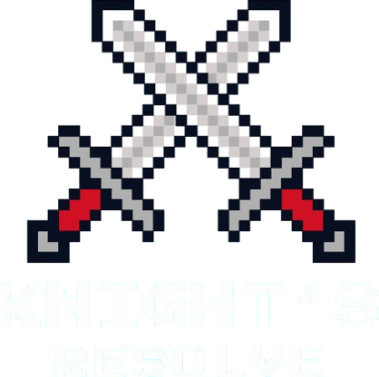

 

    

## Description
The title of this project is called “Knight’s Resolve”, which is a type of personal game featuring standalone GUI system developed using Scala and ScalaFX library. 
The overall theme of the gameplay revolves around retro 2D pixel designs with a setting featuring a knight defending against foes that are attacking the castle. 
The Knight’s Resolve is a rapid reaction-based game which tests the reaction time of the user to input the correct sequence within the allocated time to score as many points as possible while surviving to defend the castle.

Check out the demo video for Knight's Resolve: [https://youtu.be/KjR0FvuYGCU](https://youtu.be/OGhNCAAcF4g)

## Specification
- Any latest version of SBT builder
- Java 8 Library
-	Scala 2.12.19 Library
- ScalaFX 8

## Installation

Software required for this project: JetBrains IntelliJ IDEA

1. Install IntelliJ IDEA or any IDE and clone the repository.
2. Execute the (`.sbt`) to setup the environment.
3. Start the app by running (`MainApp.scala`).

## Copyright Disclaimer

All assets and background music used in this project are the property of their respective owners. 
I do not claim ownership of any third-party graphics, audio files, or other media utilized. 
These materials are used solely for non-commercial, educational, or demonstration purposes. 
All rights to these assets remain with their original creators.

- Adam Haynes (2018a) 8-bit RPG Music | Boss Battle. https://www.youtube.com/watch?v=NzFKyZc_va4. 
- Adam Haynes (2018b) 8-bit RPG Music | the heroine’s theme. https://www.youtube.com/watch?v=TNYTFOiNO4s. 
- Adam Haynes (2020) 8-bit RPG Music | Victory Theme. https://www.youtube.com/watch?v=eX1TjYv3dfc. 
- Adam Haynes (2023a) 8-bit RPG Music | Final Boss Battle. https://www.youtube.com/watch?v=tD-Ay-zhr8o. 
- Adam Haynes (2023b) 8-bit RPG Music | Game Over. https://www.youtube.com/watch?v=86lnvkAOJ7g. 
- Gaming Sound FX (2020) Sword Slash-Sound Effect HD. https://www.youtube.com/watch?v=DmDV445zi1Y. 
- Hey it’s Criz (2020) Cute Sound Effects for Editing | No copyright. https://www.youtube.com/watch?v=qZSjN3II0l8. 
- Sven Thole (2018) Bandits - Pixel Art | 2D Characters | Unity Asset Store. https://assetstore.unity.com/packages/2d/characters/bandits-pixel-art-104130. 
- Sven Thole (2022) Hero Knight - Pixel Art | 2D Characters | Unity Asset Store. https://assetstore.unity.com/packages/2d/characters/hero-knight-pixel-art-165188. 
- YTSFX (2022) Undertale damage sound effect. https://www.youtube.com/watch?v=HDjm4-SL6p8. 
